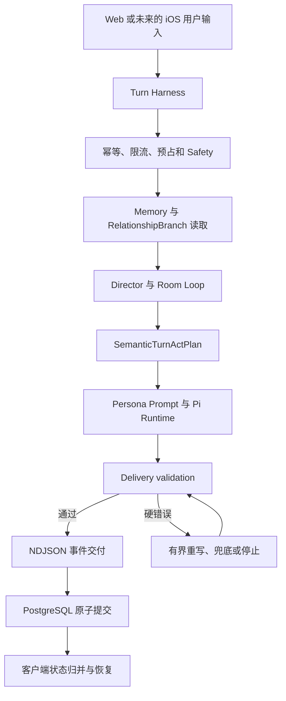

# persona16：iOS 优先的架构与性能优化计划

> 日期：2026-08-06
> 状态：实施中；阶段一至阶段四的确定性工程工作已完成，阶段五等待付费模型复测与人工盲审
> 适用范围：Turn 全链路观测、语义控制模块拆分、原生 iOS 客户端、性能优化与最终评测
> 当前依据：[PRD](PRD.md)、[领域语言](../CONTEXT.md)、[协议 0.8](evals/pilot-character-protocol-v0.8-delivery-quality.md)

## 1. 目标

这轮优化按以下顺序进行：先补齐性能与架构基线，再拆分后端核心模块；客户端优先建设原生 iOS，不先重构 Web 的 `useRoomSession.ts`；随后依据基线数据优化模型调用、Prompt 和数据库串行等待；最后回到协议 0.8、人工盲审和跨端测试完成验收。

最终需要得到五项结果：

1. 每个 Turn 都能解释时间花在了哪里，性能优化有稳定基线可比。
2. `semanticTurnControl.ts` 的内部职责完成拆分，外部接口和行为保持不变。
3. 原生 iOS 客户端完成角色选择、建房、单聊、生命周期状态和错误恢复的首个闭环。
4. 在不绕过最终交付发布门的前提下，减少模型调用、输入 Token 和 PostgreSQL 串行等待。
5. 所有质量变化经过单元测试、集成测试、协议 0.8、房间化学反应和人工盲审验证。

## 2. 已确认的范围与顺序

“先做 iOS”在本计划中的含义是客户端优先级：保留当前 Web 客户端作为可用产品和行为参考，不先投入 `useRoomSession.ts` 重构。后端计时基线和零行为变化的核心模块拆分仍放在 iOS 之前，因为它们分别提供性能依据和稳定接口。

实施分成五个可以独立合并、独立回滚的阶段：

| 阶段 | 交付结果 | 是否改变产品行为 |
| --- | --- | --- |
| 1. 性能与架构基线 | 分阶段计时、基准场景、性能报告 | 否 |
| 2. 语义控制模块拆分 | 缩小维护热点，保留兼容门面 | 否 |
| 3. 原生 iOS 闭环 | 新增 SwiftUI 客户端 | 是，新增客户端入口 |
| 4. 数据驱动的性能优化 | 减少调用、Token 和串行等待 | 是，但不改变安全与交付规则 |
| 5. Eval 与交付门 | 跨端、模型和人工验收 | 否，只验证交付质量 |

本计划预计涉及 20 至 35 个文件。新增一个原生客户端、一组跨平台协议夹具和一个 macOS CI Job，不新增后端服务，不做破坏性数据库迁移，也不把服务端 API Key 放入 iOS 客户端。

### 2.1 实施进度

- 阶段一已完成：Turn 全阶段计时、脱敏样本导出、固定场景映射和 JSON/Markdown 性能报告已经落地；类型检查、全量测试和 Web 生产构建通过。PostgreSQL 集成测试因本机未配置专用测试数据库而跳过，不能视为已验证。
- 阶段二已完成：`semanticTurnControl.ts` 从 3368 行缩为 45 行兼容门面，原有 16 个运行时导出和 25 个公共类型保持不变；184 个顶层声明经 AST 规范化比较无逻辑、正则、字符串和顺序变化，独立审查未发现可操作问题。
- 阶段三已完成：新增原生 SwiftUI 客户端、版本化 Turn v1 跨语言夹具和独立 macOS CI；真实 API、匿名 Cookie、NDJSON、房间命令、候选记忆、反馈、幂等重放和结果未知恢复闭环已经接通。独立审查发现并修复了两个竞态：流式 `error/outcome=unknown` 现在保留原请求并只允许原样重放；成员 PATCH 与新 Turn 现在共用 mutation gate，不再竞争同一房间版本。iPhone 17 Pro / iOS 26.5 完整 Unit + UI 测试 39/39 通过，Generic Simulator build、跨语言合同 5/5 和真实 API 主链验证通过。`RoomSession` 已按命令职责拆分，私有状态写边界保持不变。
- 阶段四的确定性工程工作已完成：严格纯问候在硬安全规则之后跳过模型 Safety 分类，多人房纯问候同时跳过模型 Director，但人物生成、Room Controller 和最终 Delivery validation 保持不变；候选记忆由事务外独立写入收敛为 `completeTurn()` 内与 Turn 终态一次原子提交，并有候选冲突时完整回滚的真实 PostgreSQL 证明。新增零语义变化的 `PromptBudget` 基线，统一记录固定低基数区块的字符数、UTF-8 字节数和 `utf8ByteTokenProxy` 内容趋势代理，不记录正文；该代理不包含 role、framing 或 special tokens，不能作为完整请求或 provider usage 上界。现有 30 条/12000 字符、关系证据 3 条限制不变。System Blocks 的静态接线位于单个 utterance 的重试循环外，Trace 测试证明跨重试只记录一次 system measurement；因为没有 CPU 或 cache-hit 瓶颈证据，未增加没有可见收益的跨 Turn 字符串缓存。进一步收紧到 6000/8000 会改变上下文语义，等待同 SHA 三批基线与质量 Eval 后决定。
- 阶段五的工程门和确定性 Eval 已完成：专用本地 PostgreSQL 集成测试、全仓 349/349 测试、TypeScript 类型检查、Web 生产构建、iOS 39/39 测试、Safety 6/6、房间对抗 4/4 和自然表达语料结构校验均通过。三批线上模型对照、协议 0.8 线上复测和隐藏模型来源的人工盲审仍未执行；它们分别需要单独确认模型预算和真实人工参与，不能用旧 Artifact 代替。

## 3. 当前架构与优化位置



当前主要模块职责如下：

- `apps/web`：Next.js 产品入口、Turn Harness、NDJSON 交付和 Web 房间状态。
- `packages/engine`：正典人物、Prompt、本轮语义框架、本轮对话动作计划、Director、Room Loop、安全、记忆与关系策略。
- `packages/runtime-pi`：实现 `AgentRuntime`，负责 Pi Agent Core、模型调用、取消、使用量和结构化失败。
- `packages/store`：实现 `PersonaStore`，由内存和 PostgreSQL 两个 adapter 负责房间、Turn、消息、记忆、关系、反馈和限流。
- `eval`：人物盲测、动态性、关系边界、房间化学反应、安全分流和最终交付发布门。

## 4. 阶段一：补齐 Turn 全链路计时

### 4.1 计时模型

新增统一的 `TurnTimingRecorder`。Recorder 从 Route 收到请求时创建，经预处理传入 Engine，最后由 Harness 合并并写入现有延迟字段。

固定阶段名称如下：

| 阶段 | 测量内容 |
| --- | --- |
| `idempotency_lookup` | 查询已有 Turn 和幂等重放状态 |
| `rate_limit` | 限流查询与更新 |
| `turn_reservation` | Turn 预占和并发控制 |
| `safety` | 规则筛查与模型 Safety 分类 |
| `confirmed_memory_read` | 已确认 Memory 读取 |
| `relationship_branch_read` | RelationshipBranch 读取和解析 |
| `director` | 单聊或多人房 Director 决策 |
| `persona_generation` | 人物模型生成，记录总耗时和调用次数 |
| `delivery_validation` | 交付验证，包含重写后的重复验证 |
| `room_controller` | Room Controller 仲裁，记录总耗时和次数 |
| `candidate_memory` | 候选记忆生成与准备 |
| `turn_persistence` | PostgreSQL 事务内的锁、房间、消息、事件和观测数据写入 |
| `total` | Turn 端到端总耗时 |

阶段标签必须是固定枚举。计时和 trace 不写用户正文、Prompt、人物名称、关系内容或其他高基数字段。

### 4.2 数据兼容

计时结果继续写入当前 `latency_json`，不增加数据库表。建议结构如下：

```json
{
  "totalMs": 4120,
  "validatedOutputMs": 3870,
  "firstTokenMs": 3870,
  "stagesMs": {
    "safety": 420,
    "persona_generation": 2150,
    "delivery_validation": 180,
    "turn_persistence": 75
  },
  "counts": {
    "persona_generation": 1,
    "delivery_validation": 1,
    "room_controller": 0
  }
}
```

`firstTokenMs` 暂时保留一个兼容周期，同时增加语义准确的 `validatedOutputMs`。当前正文只在通过交付验证后释放，这个指标不能描述为 provider 首 Token 时间。

`turn_persistence` 记录事务内可持久化的写入耗时。完整的 PostgreSQL `COMMIT` acknowledgement 发生在当前行已经写入之后，无法在不增加第二次更新的情况下回写同一份 `latency_json`；因此报告不能把该字段描述为完整提交确认耗时。进程级监控可以另行记录完整的 `completeTurn()` 调用耗时，但不为此增加数据库往返。

### 4.3 基准报告

增加可重复运行的性能报告，至少输出：

- 总耗时和各阶段耗时的 p50、p95。
- 每个 Turn 的模型调用次数。
- 输入、输出和缓存读取 Token。
- 按场景、模型、Prompt 版本和构建版本聚合的数据。
- 正常完成、已知失败和结果未知三类结果的分布。

报告文件只允许写入被 `.gitignore` 排除的 `artifacts/performance/`，默认拒绝覆盖已有文件；JSON 与 Markdown 输出使用不同文件名并通过临时文件原子写入。

固定基准场景覆盖普通问候、普通单聊、明确分析、边界修复、危机分流、长对话和三人房。报告必须记录样本版本、代码 SHA、模型配置和运行时间，避免不同实验条件被直接比较。

固定基准运行生成一份 `turnId -> scenarioId` 映射，脱敏导出时通过 `PERSONA16_PERF_SCENARIO_MAP` 读取。导出器只选择映射内的 Turn，并附加稳定、低基数的场景标识；报告不输出 Turn ID，也不从用户正文或 Trace 推断场景。

### 4.4 验收标准

- 完成和失败的 Turn 都有阶段计时。
- 分阶段耗时与总耗时的差异只来自嵌套阶段和计时精度，并在测试容差内。
- 多次执行的阶段同时记录累计耗时与次数。
- Trace 和报告不包含用户原文或私密关系内容。
- 使用假时钟的单元测试可以稳定验证计时结果。
- 固定场景能够生成同结构的基准报告。

### 4.5 回滚

这一阶段不迁移数据。回滚时移除 Recorder 和新增报告字段即可，旧的 `latency_json` 仍然可读。

## 5. 阶段二：拆分 `semanticTurnControl.ts`

### 5.1 拆分原则

`semanticTurnControl.ts` 当前同时承担本轮语义框架解析、历史证据判断、关系动作效果编译、计划合并、最终文本验证和 Fallback 选择。拆分只改变内部组织，不改变产品规则。

目标目录：

```text
packages/engine/src/semantic/
├── types.ts
├── turnFrame.ts
├── historicalEvidenceRules.ts
├── relationshipEffects.ts
├── actPlan.ts
├── deliveryValidator.ts
├── fallbacks.ts
└── index.ts
```

原来的 `semanticTurnControl.ts` 保留为兼容门面，继续导出：

- `compileSemanticTurnControl`
- `validateSemanticTurnDelivery`
- 现有公开类型和辅助函数

### 5.2 职责边界

`turnFrame.ts` 只从可信输入提取本轮语义框架；`historicalEvidenceRules.ts` 只判断历史内容是否有来源；`relationshipEffects.ts` 只把 active 关系事件投影为当前动作约束；`actPlan.ts` 合并安全、关系和房间规则；`deliveryValidator.ts` 使用同一计划检查最终文本；`fallbacks.ts` 只根据结构化失败和计划选择兜底。

依赖方向保持单向：

```text
TurnFrame
  -> Historical Evidence / RelationshipEffect
  -> SemanticTurnActPlan
  -> Delivery validation
  -> Fallback selection
```

Delivery validator 不反向修改动作计划，Fallback 也不能重新解释用户意图。

### 5.3 本阶段禁止项

- 不修改 Prompt 文案和 Prompt 版本。
- 不修改协议 0.8。
- 不修改 Safety、关系边界和房间参与规则。
- 不修改重写、兜底和停止的选择顺序。
- 不在文件搬迁过程中混入性能优化。

### 5.4 验收标准

- 固定夹具在拆分前后的编译结果深度一致。
- Delivery validation 的硬错误和质量观察代码完全一致。
- 固定输入生成的 Prompt 完全一致。
- 现有调用方不需要改 import 路径。
- 类型检查、引擎测试、PostgreSQL 集成测试和确定性 Eval 全部通过。

### 5.5 回滚

兼容门面使这一阶段可以整体回滚，不涉及数据和协议变更。

## 6. 阶段三：原生 iOS 首个闭环

### 6.1 技术选择

- Swift 6 和 SwiftUI。
- 最低支持 iOS 17。
- 第一版不引入第三方 Swift Package。
- 使用 `@Observable @MainActor` 管理房间会话。
- 使用 `URLSession.bytes(for:)` 消费 NDJSON。
- 使用 `NavigationStack`、`TabView`、语义系统颜色和 SF Symbols。

`@Observable` 从 iOS 17 起可以直接驱动 SwiftUI 的细粒度状态更新；`URLSession.AsyncBytes` 可以把响应作为异步字节流消费，适合现有 NDJSON 协议。

参考：[Apple Observation](https://developer.apple.com/documentation/SwiftUI/Migrating-from-the-observable-object-protocol-to-the-observable-macro?changes=_10_5%2C_10_5)、[Apple URLSession.AsyncBytes](https://developer.apple.com/documentation/foundation/urlsession/asyncbytes?changes=_9)

### 6.2 目录结构

```text
apps/ios/
├── Persona16.xcodeproj
└── Persona16/
    ├── App/
    ├── Domain/
    ├── Networking/
    ├── Features/
    │   ├── Characters/
    │   ├── Conversations/
    │   ├── Room/
    │   ├── Memories/
    │   └── Feedback/
    └── DesignSystem/
```

### 6.3 会话状态机

`RoomSession` 对外提供单一会话接口，内部使用显式状态机和事件 reducer，不堆积互相冲突的 `isLoading`、`isStreaming`、`hasError` 等布尔状态。

```text
idle
  -> loadingRoom
  -> ready
  -> submitting
  -> understanding
  -> organizing
  -> confirmingReply
  -> presentingValidatedReply
  -> awaitingTerminal
  -> ready

任意阶段 -> failedKnown | resultUnknown
```

Reducer 只接收类型化 `TurnEvent`。网络命令、事件归并、本地导航缓存和 UI 展示状态分开管理。

`turn_end` 只表示 Engine 生命周期结束，不是客户端可信的提交终态；只有 `done` 或 `error` 能结束 Pending Turn。`done.room` 是最终权威状态，必须整体替换本地房间。收到 EOF、超时、断流或本地取消但没有 `done/error` 时，一律进入 `resultUnknown`。

### 6.4 网络与恢复

网络层负责：

- 角色、房间、成员、Memory 和反馈 API。
- NDJSON 逐行解析和未知事件容错。
- 匿名 Cookie 会话保持。
- 超时、用户取消、断流和结果未知恢复。
- 在结果未知时复用原 `turnId`、原 `roomVersion` 和完全相同的请求正文重放。
- 只有确认原 Turn 失败后，才创建新的 `turnId`。

请求发出前先把完整 `PendingTurnRequest` 写入 Application Support，并启用完整文件保护；收到可信终态后立即删除。因为服务端暂时没有独立的 Turn 查询、取消端点或事件序号，首版不做中间偏移续传，也不对任意 `delta` 猜测性去重。本地取消同样属于结果未知，不能直接标记为已知失败。

API Base URL 通过 `.xcconfig` 注入。客户端不存放模型 Key。生产环境只使用 HTTPS；如果本地开发需要 HTTP，只在 Debug 配置添加范围最小的 ATS 例外。

### 6.5 跨语言协议合同

增加版本化 JSON 夹具，覆盖每一种 `TurnEvent`、恢复动作和主要 API 响应。TypeScript 测试负责验证服务端能生成这些夹具，Swift 测试负责读取同一批文件并完成解码。

实施前先统一当前分散的合同：Engine 定义了 `plan`，但 Route 当前不发送；持久化事件定义了 `done`，但 Engine 的 `TurnStreamEvent` 不包含它。跨语言夹具必须覆盖 `turn_start`、`plan`、`room_action`、`speaker_start`、`delta`、`speaker_end`、`safety_notice`、`memory_candidate`、`turn_end`、`done` 和 `error`，并明确哪些事件当前可能不发送。

协议发生不兼容变化时必须升级版本，不能依靠客户端忽略字段来掩盖语义变化。

### 6.6 首个可交付闭环

按以下顺序完成：

1. 浏览正典人物列表和详情。
2. 创建一人房。
3. 提交消息并消费完整 NDJSON 生命周期。
4. 显示“正在理解”“正在组织”“正在确认回复”等状态。
5. 展示通过最终交付发布门的正文。
6. 支持停止、已知失败和结果未知恢复。
7. 重新打开最近房间。
8. 增加邀请、暂停、恢复和移除人物。
9. 增加候选记忆确认和反馈。

Web 客户端保持现状，不在这一阶段重构 `useRoomSession.ts`。

### 6.7 测试与运行依赖

当前机器已有 Xcode 26.6、Swift 6.3.3 和 iOS SDK 26.5，但没有已安装的 Simulator Runtime 或可用设备，也没有 XcodeGen。工程使用 `project.yml` 作为真相源并提交生成的 `.xcodeproj`；XcodeGen 只是开发和 CI 依赖，不进入 App 运行时。先完成 generic Simulator 无签名构建，再补齐 Simulator Runtime 运行测试与真实闭环。

测试分为三层：

- Swift Testing：NDJSON parser、reducer、状态机和恢复策略。
- `URLProtocol` 假服务端：正常流、分块、断流、重复事件、未知事件和超时。
- XCTest 和 XCUIAutomation：建房、发送、停止、恢复和重新打开房间。

参考：[Apple Testing](https://developer.apple.com/documentation/testing)、[Xcode Testing](https://developer.apple.com/documentation/xcode/testing)

### 6.8 验收标准

- iOS Simulator 能完成角色选择到收到回复的真实闭环。
- 正文只在服务端交付验证完成后出现。
- 网络结果未知时不会生成第二个 Turn。
- App 重启后可以从服务端恢复最近房间。
- 所有版本化 NDJSON 夹具都能被 Swift 解码。
- iOS 工程可以在独立 macOS CI Job 中完成无签名 Simulator 构建和测试。

### 6.9 回滚

iOS 是新增客户端，不改变 Web 和后端协议。需要回滚时可以停止分发或删除对应构建，不影响现有 Web 用户。

## 7. 阶段四：不绕过交付门的性能优化

### 7.1 Safety 快路径

严格风险规则仍然最先执行。只有被确定性识别为普通问候，且没有危机、边界、攻击、现实责任或歧义信号的输入，才跳过模型 Safety 分类器。

边界修复、敏感输入和任何无法确定的输入继续执行完整 Safety 流程。对抗样本必须覆盖伪装问候、隐含自伤、角色攻击和先问候后提出高风险请求的输入。

### 7.2 Prompt Budget

在 Engine 内建立统一 `PromptBudget`，由代码决定每个区块的预算和裁剪顺序。当前消息、硬性关系动作效果、本轮必须处理项和安全约束永不截断。

建议初始预算：

- 普通单聊历史正文最多 6000 字符。
- 多人房历史正文最多 8000 字符。
- 本轮已发生发言最多 2000 字符。
- 关系证据继续保持少量、可追溯，不扩大为全量关系档案。

每次组装记录各区块字符数、UTF-8 字节趋势代理和供应商实际 usage，便于确认下降来自哪里。趋势代理不包含请求 framing、role 或特殊 Token，不能描述为完整 provider 输入 Token 上界。

### 7.3 稳定 System Prefix

先确认稳定 System Prefix 的本地构建是否形成可见 CPU 热点，再决定是否按 `agentId + promptVersion + buildVersion` 缓存。当前实现保证单个 utterance 的语义重试只构建一次 System Blocks，并记录供应商返回的缓存读取 Token；现有基线没有构建热点或 cache-hit 证据，因此本轮不增加跨 utterance / Turn 的字符串缓存，避免引入共享可变数组和版本失效风险。

不缓存用户回复，不在本地复用模型生成结果，也不把字符串构建缓存描述为供应商 Prompt Cache。只有 Runtime 和供应商接口明确支持缓存语义时，才启用对应能力。

### 7.4 收敛 PostgreSQL 串行等待

将候选记忆草稿作为 `completeTurn()` 的输入，在同一事务中提交房间版本、消息、事件、使用量、延迟、trace 和候选记忆。候选记忆事件只能在事务成功后交付。

内存 Store 与 PostgreSQL Store 必须继续通过同一合同测试。该改动不增加表，也不改变已确认 Memory 的确认流程。

### 7.5 改善感知延迟

iOS 在用户提交后立即显示“正在理解”。收到房间动作后显示“正在组织”，进入人物生成和交付验证时显示“正在确认回复”。这些状态只描述系统所处阶段，不暗示 provider 草稿已经可以交付。

Room Controller 在本阶段先保持规则不变。只有基线证明它是主要耗时来源，并且房间化学反应 Eval 可以覆盖改动时，才单独提出优化。

### 7.6 性能验收

在同一代码 SHA、同一模型配置和固定场景集上比较：

- 普通单聊 p95 总耗时下降至少 20%。
- 普通问候减少一次模型调用。
- 长对话 p50 输入 Token 下降至少 20%。
- 正常候选记忆 Turn 的数据库写入从两个串行提交点收敛为一个事务。
- 模型调用次数不能在其他场景无故增加。
- 最终交付硬错误为零。
- 首答通过率不能出现超过 5 个百分点的退化。

线上模型延迟存在波动，性能对比至少运行三批，并保留每批的样本、时间、模型和供应商信息。

### 7.7 回滚

Safety 快路径、Prompt Budget 和 Store 事务收敛保持独立回滚边界。Prefix 跨 Turn 缓存本轮未启用；若后续基线证明有收益，应作为独立变更实现和回滚。任何一项造成质量或稳定性退化时，可以单独关闭或回滚，不影响其他优化。

## 8. 阶段五：Eval 与最终交付门

### 8.1 工程测试

- TypeScript 类型检查。
- Engine、Runtime、Store 和 Web 单元测试。
- PostgreSQL 集成测试。
- Web 生产构建。
- Swift Testing。
- iOS XCTest UI 测试。
- macOS CI 中的 iOS Simulator 构建。
- NDJSON 合同、断流、重复事件和结果未知恢复测试。

### 8.2 产品质量评测

- 正典人物盲测。
- 人物动态性。
- 关系边界和边界修复。
- 多 Agent 房间化学反应。
- Safety 分流。
- 场景语义阶段门。
- 协议 0.8 最终交付发布门。
- 隐藏模型来源的人工盲审。

### 8.3 模型对照

最终模型对照使用同一代码 SHA、同一 Prompt 版本、同一样本集和固定 Judge 配置运行三批。Artifact 从逐条最终交付结果重新计算，不信任手工修改的汇总字段。

模型首答、重写和系统兜底分别统计。最终交付通过率决定发布，首答通过率、重试恢复率、兜底率、延迟和成本作为模型健康指标。

三批线上复测会产生模型费用。执行前单独确认预算，批准本计划不等于自动授权付费调用。

### 8.4 完成标准

以下条件全部满足后，本计划才算完成：

- 五个阶段各自的工程测试通过。
- 性能指标达到阶段四的目标，或有数据证明目标需要重新校准并经过明确批准。
- 协议 0.8 最终交付发布门通过。
- 人物、关系和房间指标不低于冻结基线。
- iOS 完成真实 API 闭环、错误恢复和 CI 验证。
- 人工盲审没有发现新的系统性退化。

## 9. 不在本轮实施的内容

- 不使用 WKWebView 包装现有 Web 页面。
- 不先重构 Web 的 `useRoomSession.ts`。
- 不做登录、订阅、推送、离线模型和 App Store 正式发布。
- 不切换默认模型供应商。
- 不添加通用浏览器、Shell 或文件工具。
- 不取消最终交付发布门，也不直接透传 provider token。
- 不创建未经用户确认的长期记忆。

WKWebView 虽然能较快产生安装包，但它会继续继承 Web 房间状态的耦合，也无法建立原生网络恢复和状态模型，因此不作为本轮 iOS 方案。

## 10. 主要风险

| 风险 | 控制方式 |
| --- | --- |
| Swift 与 TypeScript 协议漂移 | 共享版本化 JSON 夹具，服务端生成测试与 Swift 解码测试共同校验 |
| 为追求速度绕过 Delivery validation | 正文继续缓冲，最终交付发布门保持硬约束 |
| 文件拆分夹带行为变化 | 冻结 Prompt、编译结果和验证结果，阶段二只做结构调整 |
| Safety 快路径漏掉隐含风险 | 严格规则优先、歧义回退完整分类、增加对抗样本 |
| 性能数据受供应商波动影响 | 同 SHA、同配置、三批运行，保留原始分布和运行条件 |
| PostgreSQL 与内存 adapter 行为分叉 | 两个 adapter 共用合同测试 |
| iOS 本地状态成为真相源 | 房间和 Turn 继续以服务端为准，本地只保存导航缓存 |
| 模拟器环境不完整 | iOS 阶段开始时先补齐 Simulator 设备并纳入 CI |

## 11. 实施交付格式

每个阶段完成后，需要留下以下证据再进入下一阶段：

1. 本阶段修改范围和架构影响。
2. 自动测试命令与结果。
3. 基准指标或行为一致性证据。
4. 已知风险和回滚方式。
5. 下一阶段开始前需要满足的前置条件。

阶段一完成前不开始性能结论；阶段二未证明行为一致前不让 iOS 依赖新的内部结构；iOS 未完成真实 API 和恢复闭环前不把界面视为完成；协议 0.8 和人工盲审未通过前不把性能优化视为可发布。
